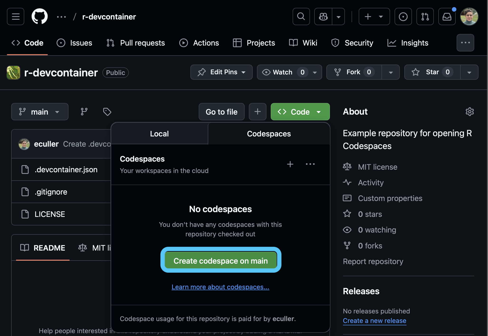

# Quick setup

> 강의 자료 저장소: https://github.com/im-dongseon/git_practice

## 1. 강의 자료 Fork 하기

* GitHub에서 강의 저장소에 접속 후 내 계정으로 Fork

1. https://github.com/im-dongseon/git_practice 접속
2. 우측 상단 **Fork** 버튼 클릭 → 내 계정에 복제본 생성

* Fork한 내 저장소를 로컬로 clone

```shell
git clone https://github.com/{your-id}/git_practice.git
cd git_practice
```

* 원본 강의 저장소를 `upstream`으로 등록 (강의 자료 업데이트 수신용)

```shell
git remote add upstream https://github.com/im-dongseon/git_practice.git
git remote -v
```

---

## 2. 새 저장소 직접 만들기 (선택)

```shell
echo "# git_practice" >> README.md
git init
git add README.md
git commit -m "first commit"
git branch -M main
git remote add origin https://github.com/{your-id}/git_practice.git
git push -u origin main
```

OR

```shell
mkdir git_practice
cd git_practice
git clone https://github.com/{your-id}/git_practice.git .
```

---

## 3. 웹 브라우저에서 바로 실습하기 (GitHub Codespaces)

* **개념**: 내 컴퓨터(로컬)에 Git이나 코드 에디터를 따로 설치하지 않고도, 웹 브라우저만 있으면 개발 환경과 터미널을 바로 띄울 수 있는 기능입니다.
* **실행 방법**:
  1. GitHub의 강의 자료(또는 파생된 Fork) 저장소에 접속합니다.
  2. 우측 초록색 `<> Code` 버튼을 클릭합니다.
  3. **Codespaces** 탭을 선택하고 `Create codespace on main`을 클릭합니다.
* **장점**: 환경 구축(Node.js, 확장기능 등) 시간을 획기적으로 절약할 수 있으며, 장소에 구애받지 않고 어디서든 동일한 개발 환경으로 작업 가능합니다.



---

## Personal access tokens (classic)

* GitHub는 보안상 비밀번호 대신 **Personal Access Token(PAT)**을 사용하여 인증
* HTTPS로 push/pull 할 때 비밀번호 대신 PAT를 입력

**발급 방법**
1. GitHub → Settings → Developer settings → Personal access tokens → Tokens (classic)
2. `Generate new token` 클릭
3. `repo` 권한 체크 후 토큰 생성
4. 생성된 토큰을 복사해두기 (다시 보기 불가)


